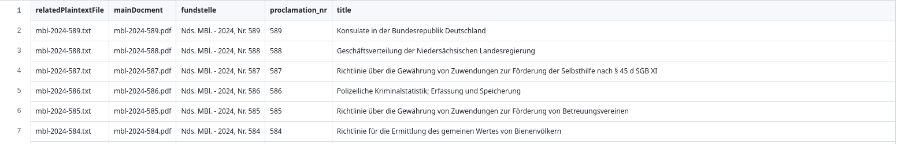

# Verkündung Niedersachsen Plaintext

Plaintext-Varianten der Verkündungen (PDF) von der Verkündungsplattform (https://www.verkuendung-niedersachsen.de/).

Ziel dieses Projektes ist es, die Inhalte der Verkündungsplattform, sogenannte Verkündungen, maschinell besser zugänglich zu machen.
Aktuell werden die Verkündungen nur als PDF bereitgestellt.
Das Lesen einer PDF benötigt entsprechende Werkzeuge und die extrahierten Texte sind teilweise noch unsauber (z.B. Tabs oder unerwartete Zeilenumbrüche).
Dieses Projekt strebt an, (wenigstens teilweise) gesäuberte und auswertbare Texte aus den PDFs bereitzustellen.

:exclamation: **Disclaimer**: Das ist ein privates Projekt und wird unentgeldlich für die Allgemeinheit bereitgestellt.

## Lizenz

Der Quellcode und die generierten Inhalte stehen unter der [Creative Commons Attribution 4.0 Lizenz](https://creativecommons.org/licenses/by/4.0/deed.de).

Die hier publizierten Daten stammen ursprünglich von Verkündungen staatlicher Seite und sind nach [§ 5 Absatz 1 UrhG](https://www.gesetze-im-internet.de/urhg/__5.html) nicht urheberrechtlich geschützt.

## Hinweise zur Nutzung

### Metadaten in CSV-Datei

In der [metadata.csv](./metadata.csv) sind alle Metadaten zu den erfassten Verkündungen in strukturierter Form zu finden.
Die Daten stammen direkt von der Verkündungsplattform (hier ein [Beispiel](https://www.verkuendung-niedersachsen.de/ndsgvbl/2024/94/)) und wurde nur minimal für die CSV-Nutzung angepasst.
Es wird empfohlen diese Datei als Ausgangspunkt bei einer automatisierten Auswertung zu verwenden.
Die Plaintext-Varianten der Verkündungen befinden sich im Ordner [plaintext](./plaintext).

### Je Verkündung eine Plaintext-Datei

Im Ordner [plaintext](./plaintext) ist für jede Verkündung im PDF-Format eine entsprechende Plaintext-Variante enthalten.
Der Dateiname jeder Datei ist gleich dem zugehörigen Dateinamen der PDF-Datei.
In den Metadaten findet man diesen in der Spalte `mainDocment`.

**Hier ein Beispiel:** PDF-Datei der Verkündung heißt `mbl-2024-559.pdf` und die zugehörige Plaintext-Datei heißt `mbl-2024-559.txt` und befindet sich unter [plaintext/mbl-2024-559.txt](./plaintext/mbl-2024-559.txt).

### Aktualisierung der Daten

Für die lokale Ausführung des Skriptes zur Datenabholung und -aufbereitung steht ein [Docker](./docker) Container bereit.
Diesen einfach bauen und danach starten, z.B. unter Linux über das Terminal mittels `cd docker && make`.
Im Container selbst einfach make eingeben und die Daten werden auf den neusten Stand gebraucht.

Für alle, die ohne Docker arbeiten wollen: der Hauptteil des Programm ist lokalisiert unter [./src/VerkuendungNiedersachsenPlaintext.php](./src/VerkuendungNiedersachsenPlaintext.php).
Im [bin](./bin) Ordner ist eine kleine run-Datei für einfachere Nutzung über das Terminal.

## Projektstatus

Das Projekt befindet sich noch in einem sehr frühen Status und kann daher noch Fehler in den Daten enthalten.
Ich freue mich über Feedback und auch Pull Requests, die das Projekt voranbringen.
